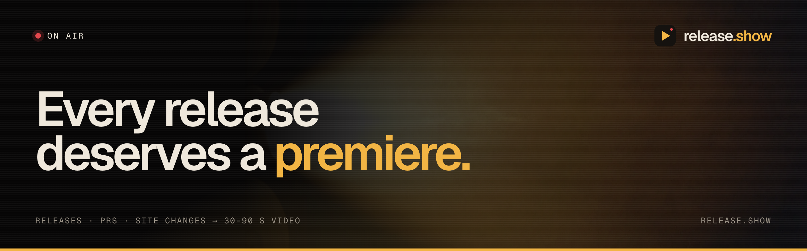

<p align="center">
  
</p>

<p align="center">
  
  
  
  
  
  
  
</p>

<p align="center">
  <b>release.show</b> · a <a href="https://factory0.ventures">Factory Zero</a> venture
</p>

---

# The site

The marketing site for **release.show**, which turns GitHub releases, merged
pull requests and website changes into 30 to 90 second videos, plus the blog
post, release widget, social posts and email digest that go with them. One
page, one stylesheet and one script, served by Cloudflare as static assets. No framework,
no bundler, no build step and no runtime dependency.

It was designed in Claude Design (`release.show Landing v2 White.dc.html`) and
ported from its React template to static HTML: every reel, the scroll-driven
scenes, the player and the pricing tickets are in the HTML, and the script only
animates them. The photographic stills are generated with
[Higgsfield](https://higgsfield.ai) (see [The stills](#the-stills)).

## The rule this site is built around

release.show is in **early access**. So:

- Every call to action leads to the early-access form, not to a GitHub
  connect flow that does not exist yet. The design's "Connect GitHub" became
  "Get early access"; the finale says the invite is to connect GitHub.
- Pricing is shown as **launch pricing for early access**, and `llms.txt` and
  the JSON-LD say the same (`availability: PreOrder`).
- The "acme" project, its versions, episodes and dates are an **illustration**,
  and the player and the channel carry an `illustration` chip. Keep them.
- **Invent nothing.** The design canvas had two "Customer quote placeholder"
  testimonials and four "Customer logo" slots. Neither is on the page, and
  neither comes back until there is a real customer who agreed to it.

Claims are tracked in [`COPY.md`](COPY.md).

## The page

| Anchor | Reel | Job |
| :--- | :--- | :--- |
| `#top` | 01 · Opening titles | The claim, the five extra outputs, two calls to action |
| `#premiere` | 02 · The premiere | A 20-second illustrative episode in a player: four scenes, captions, chapters, play/pause, 16:9 / 1:1 / 9:16. It grows to full bleed as you scroll |
| | 03 · The problem | "Release notes nobody reads" turns into "A video people watch" |
| `#acts` | 04 · How it works | Connect, ship as usual, premiere, scrubbed by scroll |
| `#features` | 05 · Features | Seven frames on a film strip that scrolls sideways |
| `#outputs` | 06 · Every format | Avatar presenter, blog post, release widget, social posts, email digest |
| `#programme` | 07 · The channel | `release.show/acme`, an episode list with a hover title card |
| | 08 · Credits | The integrations |
| `#admission` | 09 · Pricing | Four tickets, monthly / annual, add-ons |
| `#finale` | 10 · Finale | A 3-2-1 film leader, then the early-access form |

Plus `404.html`, `llms.txt`, `sitemap.xml`, `robots.txt`, `site.webmanifest`,
`.well-known/security.txt` and an Open Graph card.

## How it moves

`assets/releaseshow.js` sets three custom properties on scroll, once per frame:

- `--p` on each `[data-scene]`: progress through its sticky run, 0 to 1.
- `--v` on each `[data-win="a,b,fade"]` inside a scene: 1 while `--p` is
  between `a` and `b`, ramping over `fade`.
- `--e` on each `[data-reveal]`: 0 to 1 as it enters the viewport.

The CSS does all the moving with those, and every one has a default. With the
script blocked (`<html class="no-js">`) or with `prefers-reduced-motion`, the
page switches to static mode: the tall scenes collapse to their content, every
window shows at once, the film strip wraps, and the form falls back to a
`mailto:`.

## Layout

```
.
├── index.html                  the page
├── 404.html
├── assets/
│   ├── releaseshow.css         the whole design system, tokens at the top
│   ├── releaseshow.js          scroll scenes, the player, hover card, billing toggle, sign-up
│   ├── favicon.svg             the mark
│   ├── img/*.webp              Higgsfield stills (tools/generate-images.sh)
│   ├── logos/*.svg             integration marks, from Simple Icons (CC0)
│   ├── og.png                  Open Graph card
│   ├── apple-touch-icon.png  icon-512.png
│   ├── org-avatar.png          GitHub organization avatar, uploaded by hand
│   └── readme-banner.png       the banner above
├── tools/
│   ├── generate-images.sh      the Higgsfield prompts, and the script that renders them
│   ├── build-dist.sh           assembles dist/ from an allowlist, stamps cache hashes
│   ├── deploy.sh               deploys origin/main, and nothing else
│   ├── og-render.html          source for og.png
│   ├── banner-render.html      source for the README banner
│   ├── avatar-render.html      source for the org avatar
│   └── render-og.sh            renders all of the above with headless Chrome
├── llms.txt  robots.txt  sitemap.xml  site.webmanifest  _headers  _redirects
└── COPY.md                     every factual claim, with its source
```

## Local preview

No build step, but the page uses root-relative paths, so serve it rather than
opening it as `file://`:

```sh
python3 -m http.server 8080
# then http://localhost:8080/
```

The sign-up form will not reach the waitlist from localhost, and says so with
the contact address.

## The stills

Four photographic stills sit behind the hero, the presenter cards, the blog
post's hero frame and the finale. They are generated with Higgsfield's GPT
Image 2, and the prompts in `tools/generate-images.sh` are their source:

```sh
higgsfield auth login             # once
tools/generate-images.sh          # every still that is missing
tools/generate-images.sh finale   # redo one
tools/render-og.sh                # then refresh og.png and the banner, which use them
```

About 6.5 credits a still. `build-dist.sh` refuses to build while a still the
stylesheet points at is missing, so a deploy can never ship a background that
404s. Every still is generic on purpose: no real person, product UI, logo or
on-image text.

## Regenerating images

```sh
./tools/render-og.sh
```

The GitHub organization avatar is written to `assets/org-avatar.png`. GitHub has
no API for organization avatars, so upload it by hand at
`github.com/organizations/Release-Show/settings/profile`.

## Deploy

A Cloudflare Worker with static assets, `releaseshow-website` (`wrangler.toml`), on the Factory0 account. It has no script: Cloudflare serves `dist/` and applies `_headers` and `_redirects`. `release.show` and `www.release.show` are its custom domains, attached by the deploy itself. Merge to `main`, then:

```sh
tools/deploy.sh              # deploy origin/main
tools/deploy.sh --dry-run    # build it and say what would ship
```

The script deploys **`origin/main` and nothing else**. It fetches, checks `main`
out into a throwaway worktree, builds there, deploys that, and removes it; the
deployment records the commit. It never reads your working copy or its `dist/`.
More than one agent session can work in one checkout at once, and deploying
from a working copy can publish another session's uncommitted edits or roll
back work merged minutes earlier. Do not run `wrangler deploy` by
hand.

Edit in a worktree of your own, not in the shared checkout:

```sh
git worktree add ../releaseshow-website-worktrees/<name> -b <branch> origin/main
```

Use an API token for the Cloudflare account that owns `release.show`. The
default `wrangler login` may be a different account, and the deploy then fails
with `Authentication error [code: 10000]`.

## The waitlist

The form posts `{ email, product: "release.show", answers: { repo }, captchaToken }`
to `https://api.release.show/v1/waitlist`: a Cloudflare Worker
(`Release-Show/waitlist-backend`) running [Cratefield](https://cratefield.com)'s
harness `waitlist` module with its own D1 database. On any failure the form
says so and offers `contact@release.show` instead of pretending the address
was saved.

**The human check.** `captchaToken` comes from a Cloudflare Turnstile widget
(Managed mode, site key `0x4AAAAAAFM4K5IcBaDXU6Qx`, hostnames `release.show`
and `www.release.show`), rendered explicitly by `assets/releaseshow.js` with
the action `waitlist`. The Worker verifies the token with siteverify, bound to
the hostname `release.show` and that action, and answers `400`
`.../problems/captcha-failed` when it is missing or rejected. Tokens are
single-use, so the script resets the widget after every attempt. If the
widget cannot load (blocked, or no `turnstile` after 10 s), the form says so
and does not send. On localhost the widget shows a domain error: the site key
only works on the two hostnames above, so test a real join on the live site,
by hand.

The Worker's CORS allows `https://release.show` only, and it binds Turnstile
to that one hostname, so the form works on the apex, not on
`www.release.show`. `www` should redirect to the apex (a Cloudflare Redirect
Rule).

The Worker mails a double opt-in link, so a join ends on a "Check your inbox"
panel: it names the address, points at Spam/Promotions, tells people who
confirmed before that they are already in (the API answers the same `202`
whatever the address's state, by design), and offers "Use a different email".
The panel takes focus and is announced; while sending, the button is disabled
with `aria-busy` and a spinner.

**Content-Security-Policy.** `_headers` sends a strict policy with no
`'unsafe-inline'`: `default-src 'self'`, `frame-ancestors 'none'`,
`object-src 'none'`, `base-uri 'self'`, and every other directive limited to
what the pages actually load (see the comments in `_headers`). Turnstile is the
only third party in `script-src` and `frame-src`, and `connect-src` is the
waitlist Worker alone. Two things keep it that way, and
`tools/build-dist.sh` refuses to build when either drifts:

- an inline `<script>` is allowed only by its sha256 in `_headers`; and
- no page may carry a `style=""` attribute. Write the style, then run
  `python3 tools/csp-inline-styles.py`: it moves every attribute into
  `assets/releaseshow-inline.css` as a class. Each rule weighs as much as the inline
  style did, so the look does not change.

## House rules for edits

1. **Invent nothing.** No metrics, user counts, testimonials, customer logos or
   render times.
2. **Early access is the tense.** Nothing on the page offers a flow that does
   not exist yet.
3. **The demo says it is a demo.** Keep the `illustration` chips.
4. **Integrations are listed, not endorsed.** Keep the trademark note under the
   credits.
5. **No dark patterns.** No fake urgency, no pre-checked boxes, nothing gated
   behind an email.

---

<p align="center">
  <sub>No tracking cookies · Built by <a href="https://factory0.ventures">Factory Zero</a></sub>
</p>
